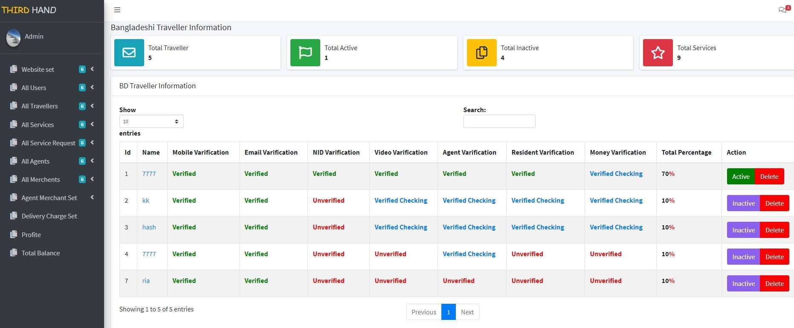

## ABOUT THIRD HAND APPS
#### Api List :
-      Authentication  
         1 . SignUp
                  .Signup create Post method.
                  .All country signup at plate from.
         2 . Login
                  .Signin multiauth system using Guards
                  .Made authentication according to country and route guards 
         3 . Single User information
         4 . Update User
                 .User information update api
         4 .         
 -    Traveller 
         1. Traveller create 
         2. Traveller update
                   . traveller varified system
         3. All Traveller 
-     Service 
         1. Service create 
                   .If traveller 70% verified then create service
         2. Available service
         3. single Service information
         4. Personal service
         5. All Service
         
-     Request Service
         1. Request Service Create
         2. Single User All Request Services
         3. Single service All Request 
         4. Reequest Decline
         5. Request Accept 
                   . QR Code Generate
         6. Request Cancle
         7. QR Code Get User
         8. Single User QR code Post
         9. Delivery Success
         10.recommand service

-    Rating Review
         1. Review create
         2. Single Traveller all Review & Rating
         3. Single User all Review & Rating
         4. 

-    All Successfully Delivery
         1. All Successfull Delivery Get
         2. 
         
-    Search Service
         1. Search service
               . Location search latitude and logitude
               . Distance measure service find
         2. Recommand search service
               . user Location search all service
               . Current location latitude Lognitude Distance measure service
  
-       Affilate Refer
          1. Affiliate link
          2. sponsor refer id
          3. 
          
          
 -     Top earnner 
         1. country top earnner
         2. world top earner 
         3. 
         
-      Foreign Service
         1. foreign service
         2. Foregin Request service
        
 
-       Agent 
         1. agent verified
         2. traveller varified
         
-       Maechant 
         1.Merchant
        

- **[Vehikl](https://vehikl.com/)**
- **[Tighten Co.](https://tighten.co)**
- **[Kirschbaum Development Group](https://kirschbaumdevelopment.com)**
- **[64 Robots](https://64robots.com)**
- **[Cubet Techno Labs](https://cubettech.com)**
- **[Cyber-Duck](https://cyber-duck.co.uk)**
- **[British Software Development](https://www.britishsoftware.co)**
- **[Webdock, Fast VPS Hosting](https://www.webdock.io/en)**
- **[DevSquad](https://devsquad.com)**
- [UserInsights](https://userinsights.com)
- [Fragrantica](https://www.fragrantica.com)
- [SOFTonSOFA](https://softonsofa.com/)
- [User10](https://user10.com)
- [Soumettre.fr](https://soumettre.fr/)
- [CodeBrisk](https://codebrisk.com)
- [1Forge](https://1forge.com)
- [TECPRESSO](https://tecpresso.co.jp/)
- [Runtime Converter](http://runtimeconverter.com/)
- [WebL'Agence](https://weblagence.com/)
- [Invoice Ninja](https://www.invoiceninja.com)
- [iMi digital](https://www.imi-digital.de/)
- [Earthlink](https://www.earthlink.ro/)
- [Steadfast Collective](https://steadfastcollective.com/)
- [We Are The Robots Inc.](https://watr.mx/)
- [Understand.io](https://www.understand.io/)
- [Abdel Elrafa](https://abdelelrafa.com)
- [Hyper Host](https://hyper.host)
- [Appoly](https://www.appoly.co.uk)
- [OP.GG](https://op.gg)

## ABOUT THIRD HAND 

Thank you for considering contributing to the Laravel framework! The contribution guide can be found in the [Laravel documentation](https://laravel.com/docs/contributions).

## Code of Conduct

In order to ensure that the Laravel community is welcoming to all, please review and abide by the [Code of Conduct](https://laravel.com/docs/contributions#code-of-conduct).

## Security Vulnerabilities

If you discover a security vulnerability within Laravel, please send an e-mail to Taylor Otwell via [taylor@laravel.com](mailto:taylor@laravel.com). All security vulnerabilities will be promptly addressed.

## License

The Laravel framework is open-sourced software licensed under the [MIT license](https://opensource.org/licenses/MIT).
